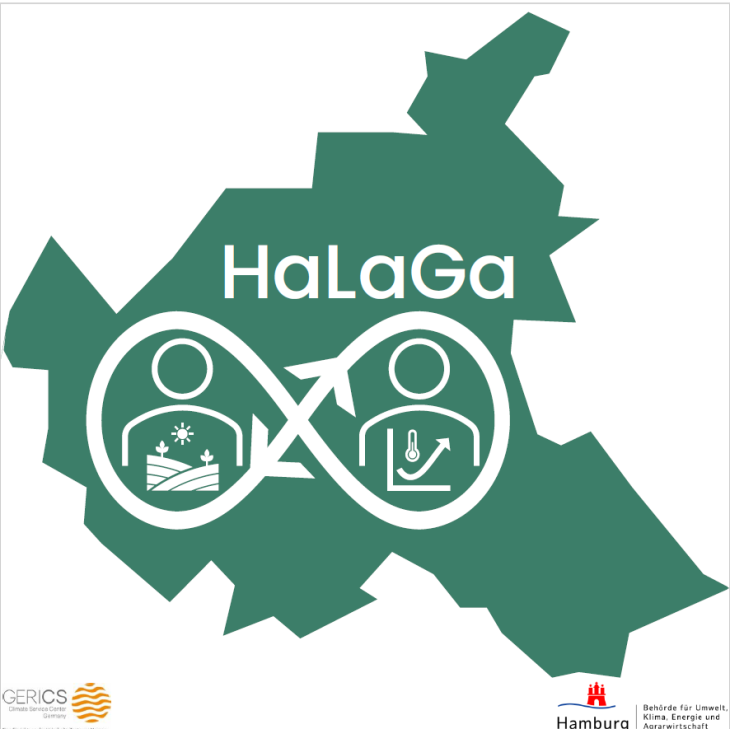

Der Klimawandel ist auch in Hamburg längst Realität: Hitze, Starkregen und andere Wetterextreme nehmen zu. Damit steigen die witterungsbedingten Risiken für landwirtschaftliche und gartenbauliche Betriebe. Ohne geeignete Vorsorgemaßnahmen sind die Betriebe diesen Risiken zunehmend ausgesetzt. Wie können sich die Betriebe besser darauf vorbereiten?

Bereits im Vorgängerprojekt [„HaLaGa“] (https://www.gerics.de/science/projects/detail/117894/index.php.de) widmete sich das GERICS der Aufgabe, landwirtschaftliche und gartenbauliche Betriebe in ihrem Risikomanagement angesichts zunehmender witterungsbedingter Risiken zu unterstützen. Das Projekt wurde von der Behörde für Umwelt, Klima, Energie und Agrarwirtschaft (BUKEA) für die Laufzeit von November 2024 bis Dezember 2025 bewilligt.

Im Jahr 2025 hat das GERICS intensiv mit insgesamt sechs Betrieben zusammengearbeitet. Während regelmäßiger Vor-Ort-Besuche wurde gemeinsam ein Verfahren für eine Klima-Risiko-Analyse auf Betriebsebene entwickelt und angewendet. Zusammen mit jedem Betrieb wurde analysiert, wie sich witterungsbedingte Risiken gegenwärtig und zukünftig auf betriebliche Arbeitsprozesse und Produktionssysteme auswirken können. In Zusammenarbeit mit der Beratung der Landwirtschaftskammer Hamburg wurden für jeden Betrieb individuelle Lösungsansätze erarbeitet, die dazu beitragen können, die Folgen der Witterungsrisiken zu mindern.

Aus den Gesprächen mit den Betrieben und der Beratung entstand die Idee, einen „Betroffenheitscheck“ zu entwickeln. Dieser soll aufzeigen, wie wichtig es für die Betriebe ist, sich bereits heute im Rahmen ihres Risikomanagements mit witterungsbedingten Risiken auseinanderzusetzen. Aus der Zusammenarbeit mit der Landwirtschaftskammer Hamburg ist im Sommer 2025 ein erster Prototyp eines solchen „Betroffenheitschecks“ entstanden.

Im Jahr 2026 wird die Arbeit als Projekt „HaLaGa2“ für ein weiteres Jahr fortgesetzt – erneut gefördert von der BUKEA. Das GERICS wird zum einen den „Betroffenheitscheck“ fertigstellen und zum anderen die betriebsspezifische Klima-Risiko-Analyse so aufbereiten, dass sie praxistauglich in der Beratung eingesetzt werden kann. Gemeinsam mit der Beratung der Landwirtschaftskammer erarbeitet das GERICS zudem ein Konzept, wie die Beratung zum Umgang mit witterungsbedingten Risiken und zur Anpassung an die Folgen des Klimawandels in die reguläre Beratungspraxis der Landwirtschaftskammer integriert werden kann.

Im Jahr 2026 wird das GERICS die sechs Betriebe aus der ersten Projektphase weiterhin begleiten. Zusätzlich stehen Ressourcen für die Zusammenarbeit mit weiteren interessierten landwirtschaftlichen und gartenbaulichen Betrieben in Hamburg zur Verfügung.

Im Dezember 2026 wird erneut die öffentliche Veranstaltung „Klimaschnack“ stattfinden.

Das Projektvorhaben läuft von Januar bis Dezember 2026.